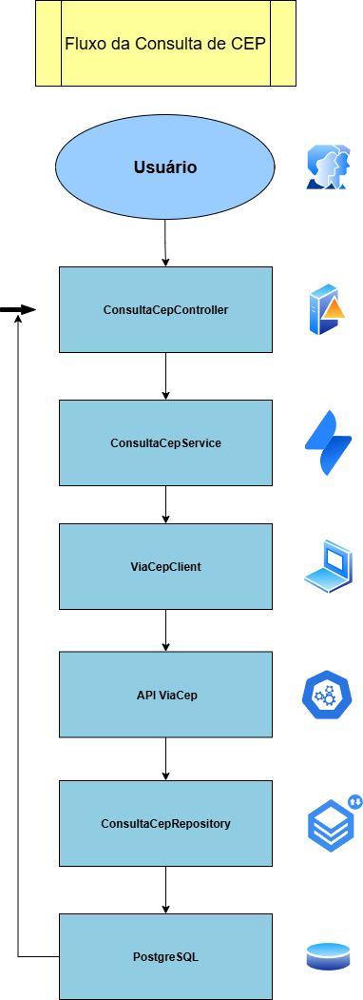
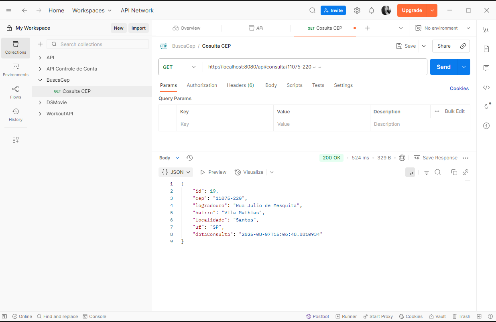

# Projeto Consulta de CEP

Este projeto é uma API desenvolvida em **Spring Boot** para consultar dados de endereço a partir de um **CEP** usando a API pública do **ViaCEP**.  
Além de retornar os dados ao usuário, a aplicação também **registra logs de consulta no banco de dados (PostgreSQL)** com data e hora da requisição.

---

## Fluxo da Consulta de CEP

A imagem abaixo representa o fluxo completo da aplicação, desde a requisição do usuário até a persistência dos dados no banco:




---

## Tecnologias Utilizadas

- Java 17
- Spring Boot
- OpenFeign
- PostgreSQL
- JPA/Hibernate
- Swagger (para documentação da API)
- WireMock ou Mockoon (mock de API externo - opcional)

---

## Funcionalidades

-  Buscar endereço por CEP
-  Registrar log da consulta no banco (CEP consultado, data/hora, resultado da API)
-  Integração com API externa (ViaCEP)
-  Documentação automática da API com Swagger

---

## Testes

Você pode simular chamadas à API ViaCEP utilizando ferramentas como:

- [Mockoon](https://mockoon.com/)
- [WireMock](http://wiremock.org/)

---

## Banco de Dados

O projeto utiliza um banco **PostgreSQL**, com a tabela de logs contendo os seguintes campos:

- `id` (UUID)
- `cep`
- `data_consulta`
- `logradouro`, `bairro`, `cidade`, `uf` (etc.)

---

## Como Executar

1. Clone o repositório  
2. Configure seu banco PostgreSQL (e defina no `application.properties`)  
3. Rode a aplicação com `mvn spring-boot:run` ou pelo seu IDE  
4. Acesse: `http://localhost:8080/swagger-ui.html` para testar as rotas

---

## Exemplo de Requisição

GET /api/consulta/01001-000



## Subindo com Docker

1. Rode `docker-compose up -d` para subir o banco e o mock.
2. Ajuste o endpoint da API ViaCEP para apontar para o WireMock (`http://localhost:8081`).
3. Rode a aplicação normalmente.

**Resposta:**
```json
{
  "cep": "01001-000",
  "logradouro": "Praça da Sé",
  "bairro": "Sé",
  "localidade": "São Paulo",
  "uf": "SP",
  "dataConsulta": "2025-08-07T21:34:12"
}
```

**Desenvolvido por**
Ysla Chaves
📧 ysla.chaves.b@gmail.com
🔗 https://linkedin.com/in/ysla-chaves 
🔗 https://github.com/theysla
